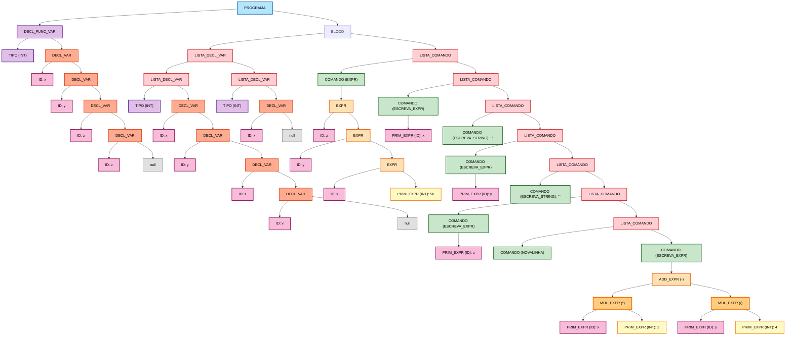
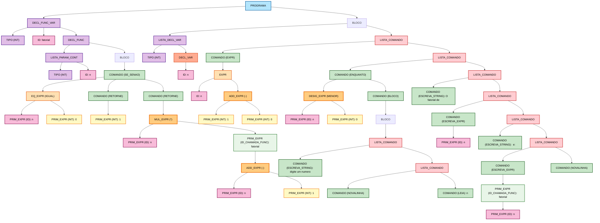

# Diagrama - Expressão Correta

```mermaid
graph TD
    A["PROGRAMA"] --> B["DECL_FUNC_VAR"]
    A --> C["BLOCO"]
    
    B --> D["TIPO (INT)"]
    B --> E["DECL_VAR"]
    
    E --> F["ID: x"]
    E --> G["DECL_VAR"]
    
    G --> H["ID: y"]
    G --> I["DECL_VAR"]
    
    I --> J["ID: z"]
    I --> K["DECL_VAR"]
    
    K --> L["ID: v"]
    K --> M["null"]
    
    C --> N["LISTA_DECL_VAR"]
    C --> O["LISTA_COMANDO"]
    
    N --> P["LISTA_DECL_VAR"]
    N --> Q["LISTA_DECL_VAR"]
    
    P --> R["TIPO (INT)"]
    P --> S["DECL_VAR"]
    
    S --> T["ID: x"]
    S --> U["DECL_VAR"]
    
    U --> V["ID: y"]
    U --> W["DECL_VAR"]
    
    W --> X["ID: z"]
    W --> Y["DECL_VAR"]
    
    Y --> Z["ID: v"]
    Y --> AA["null"]
    
    Q --> BB["TIPO (INT)"]
    Q --> CC["DECL_VAR"]
    
    CC --> DD["ID: x"]
    CC --> EE["null"]
    
    O --> FF["COMANDO (EXPR)"]
    O --> GG["LISTA_COMANDO"]
    
    FF --> HH["EXPR"]
    
    HH --> II["ID: z"]
    HH --> JJ["EXPR"]
    
    JJ --> KK["ID: y"]
    JJ --> LL["EXPR"]
    
    LL --> MM["ID: x"]
    LL --> NN["PRIM_EXPR (INT): 50"]
    
    GG --> OO["COMANDO (ESCREVA_EXPR)"]
    GG --> PP["LISTA_COMANDO"]
    
    OO --> QQ["PRIM_EXPR (ID): x"]
    
    PP --> RR["COMANDO (ESCREVA_STRING): ' '"]
    PP --> SS["LISTA_COMANDO"]
    
    SS --> TT["COMANDO (ESCREVA_EXPR)"]
    SS --> UU["LISTA_COMANDO"]
    
    TT --> VV["PRIM_EXPR (ID): y"]
    
    UU --> WW["COMANDO (ESCREVA_STRING): ' '"]
    UU --> XX["LISTA_COMANDO"]
    
    XX --> YY["COMANDO (ESCREVA_EXPR)"]
    XX --> ZZ["LISTA_COMANDO"]
    
    YY --> AAA["PRIM_EXPR (ID): z"]
    
    ZZ --> BBB["COMANDO (NOVALINHA)"]
    ZZ --> CCC["COMANDO (ESCREVA_EXPR)"]
    
    CCC --> DDD["ADD_EXPR (-)"]
    
    DDD --> EEE["MUL_EXPR (*)"]
    DDD --> FFF["MUL_EXPR (/)"]
    
    EEE --> GGG["PRIM_EXPR (ID): x"]
    EEE --> HHH["PRIM_EXPR (INT): 2"]
    
    FFF --> III["PRIM_EXPR (ID): y"]
    FFF --> JJJ["PRIM_EXPR (INT): 4"]

    classDef programa fill:#b3e5fc,stroke:#01579b,stroke-width:2px,color:#000
    classDef declaracao fill:#e1bee7,stroke:#4a148c,stroke-width:2px,color:#000
    classDef declvar fill:#ffab91,stroke:#d84315,stroke-width:2px,color:#000
    classDef lista fill:#ffcdd2,stroke:#c62828,stroke-width:2px,color:#000
    classDef comando fill:#c8e6c9,stroke:#1b5e20,stroke-width:2px,color:#000
    classDef expressao fill:#ffe0b2,stroke:#e65100,stroke-width:2px,color:#000
    classDef operador fill:#ffcc80,stroke:#ef6c00,stroke-width:3px,color:#000
    classDef identificador fill:#f8bbd9,stroke:#880e4f,stroke-width:2px,color:#000
    classDef constante fill:#fff9c4,stroke:#f57f17,stroke-width:2px,color:#000
    classDef nulo fill:#e0e0e0,stroke:#424242,stroke-width:1px,color:#000

    class A programa
    class B,D,R,BB declaracao
    class E,G,I,K,S,U,W,Y,CC declvar
    class N,P,Q,O,GG,PP,SS,UU,XX,ZZ lista
    class FF,OO,RR,TT,WW,YY,BBB,CCC comando
    class HH,JJ,LL,DDD expressao
    class EEE,FFF operador
    class F,H,J,L,T,V,X,Z,DD,II,KK,MM,QQ,VV,AAA,GGG,III identificador
    class NN,HHH,JJJ constante
    class M,AA,EE nulo
```
---

# Diagrama - Fatorial

```mermaid
graph TD
    A["PROGRAMA"] --> B["DECL_FUNC_VAR"]
    A --> C["BLOCO"]
    
    B --> D["TIPO (INT)"]
    B --> E["ID: fatorial"]
    B --> F["DECL_FUNC"]
    
    F --> G["LISTA_PARAM_CONT"]
    F --> H["BLOCO"]
    
    G --> I["TIPO (INT)"]
    G --> J["ID: n"]
    
    H --> K["COMANDO (SE_SENAO)"]
    
    K --> L["EQ_EXPR (IGUAL)"]
    K --> M["COMANDO (RETORNE)"]
    K --> N["COMANDO (RETORNE)"]
    
    L --> O["PRIM_EXPR (ID): n"]
    L --> P["PRIM_EXPR (INT): 0"]
    
    M --> Q["PRIM_EXPR (INT): 1"]
    
    N --> R["MUL_EXPR (*)"]
    
    R --> S["PRIM_EXPR (ID): n"]
    R --> T["PRIM_EXPR (ID_CHAMADA_FUNC): fatorial"]
    
    T --> U["ADD_EXPR (-)"]
    
    U --> V["PRIM_EXPR (ID): n"]
    U --> W["PRIM_EXPR (INT): 1"]
    
    C --> X["LISTA_DECL_VAR"]
    C --> Y["LISTA_COMANDO"]
    
    X --> Z["TIPO (INT)"]
    X --> AA["DECL_VAR"]
    
    AA --> BB["ID: n"]
    
    Y --> CC["COMANDO (EXPR)"]
    Y --> DD["LISTA_COMANDO"]
    
    CC --> EE["EXPR"]
    
    EE --> FF["ID: n"]
    EE --> GG["ADD_EXPR (-)"]
    
    GG --> HH["PRIM_EXPR (INT): 1"]
    GG --> II["PRIM_EXPR (INT): 0"]
    
    DD --> JJ["COMANDO (ENQUANTO)"]
    DD --> KK["LISTA_COMANDO"]
    
    JJ --> LL["DESIG_EXPR (MENOR)"]
    JJ --> MM["COMANDO (BLOCO)"]
    
    LL --> NN["PRIM_EXPR (ID): n"]
    LL --> OO["PRIM_EXPR (INT): 0"]
    
    MM --> PP["BLOCO"]
    
    PP --> QQ["LISTA_COMANDO"]
    
    QQ --> RR["COMANDO (ESCREVA_STRING): digite um numero"]
    QQ --> SS["LISTA_COMANDO"]
    
    SS --> TT["COMANDO (NOVALINHA)"]
    SS --> UU["COMANDO (LEIA): n"]
    
    KK --> VV["COMANDO (ESCREVA_STRING): O fatorial de "]
    KK --> WW["LISTA_COMANDO"]
    
    WW --> XX["COMANDO (ESCREVA_EXPR)"]
    WW --> YY["LISTA_COMANDO"]
    
    XX --> ZZ["PRIM_EXPR (ID): n"]
    
    YY --> AAA["COMANDO (ESCREVA_STRING):  e: "]
    YY --> BBB["LISTA_COMANDO"]
    
    BBB --> CCC["COMANDO (ESCREVA_EXPR)"]
    BBB --> DDD["COMANDO (NOVALINHA)"]
    
    CCC --> EEE["PRIM_EXPR (ID_CHAMADA_FUNC): fatorial"]
    
    EEE --> FFF["PRIM_EXPR (ID): n"]

    classDef programa fill:#b3e5fc,stroke:#01579b,stroke-width:2px,color:#000
    classDef declaracao fill:#e1bee7,stroke:#4a148c,stroke-width:2px,color:#000
    classDef declvar fill:#ffab91,stroke:#d84315,stroke-width:2px,color:#000
    classDef lista fill:#ffcdd2,stroke:#c62828,stroke-width:2px,color:#000
    classDef comando fill:#c8e6c9,stroke:#1b5e20,stroke-width:2px,color:#000
    classDef expressao fill:#ffe0b2,stroke:#e65100,stroke-width:2px,color:#000
    classDef operador fill:#ffcc80,stroke:#ef6c00,stroke-width:3px,color:#000
    classDef identificador fill:#f8bbd9,stroke:#880e4f,stroke-width:2px,color:#000
    classDef constante fill:#fff9c4,stroke:#f57f17,stroke-width:2px,color:#000
    classDef funcao fill:#e8f5e8,stroke:#2e7d32,stroke-width:2px,color:#000

    class A programa
    class B,D,F,G,I,X,Z declaracao
    class AA declvar
    class Y,DD,KK,QQ,SS,WW,YY,BBB lista
    class K,M,N,CC,JJ,MM,RR,TT,UU,VV,XX,AAA,CCC,DDD comando
    class EE,L,R,U,GG,LL expressao
    class GG,LL,R,U operador
    class E,J,BB,FF,O,S,V,NN,ZZ,FFF identificador
    class P,Q,W,HH,II,OO constante
    class T,EEE funcao
```
